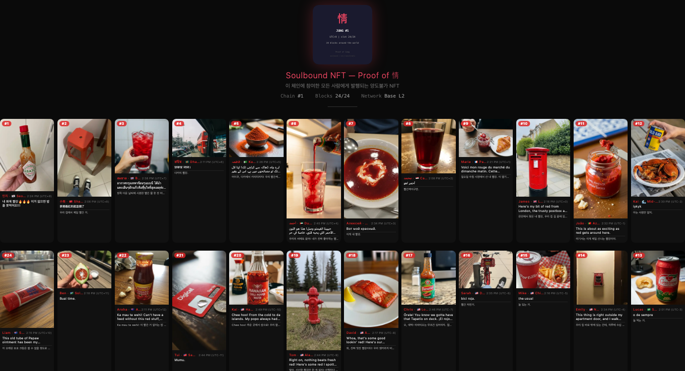
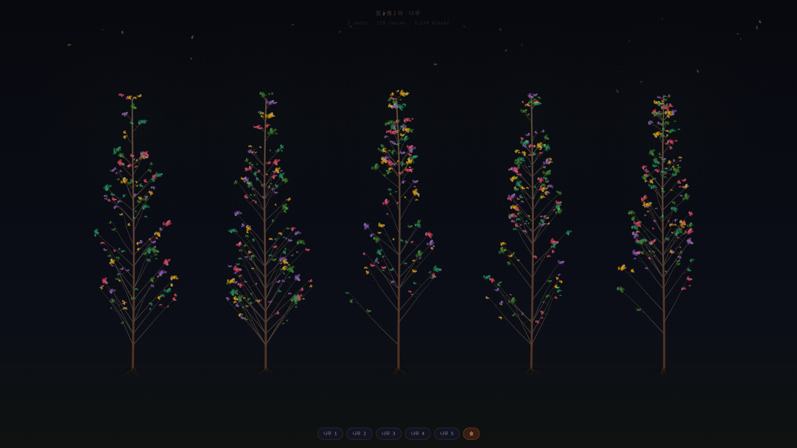

# 정 (Jung) — 24시간 감정 릴레이

> 시간이 만드는 연결. 기다림이 만드는 정.

**정(情)**은 시간대를 따라 사진과 글이 릴레이되는 Telegram 봇입니다.
매 정시, 한 사람의 사진 한 장과 짧은 글이 서쪽으로 다음 타임존의 누군가에게 전달됩니다. 24시간, 24개 타임존을 거쳐 지구를 한 바퀴 돌아 원래 보낸 사람에게 돌아옵니다.

## 컨셉

한국어에만 있는 감정 **정(情)** — 시간이 쌓여야 생기는 깊은 유대감.

- **사진 1장 + 텍스트(200자)** — 가볍지만 진심을 담을 수 있는 단위
- **시간 기반 릴레이** — 24개 타임존을 따라 서쪽 방향으로 전달
- **정지기(AI 모더레이터)** — 모든 콘텐츠를 검증하고 따뜻한 코멘트를 남김
- **포크 체인** — 같은 타임존에 여러 참여자 → Copy-on-Fork로 체인 분기
- **온체인 기록** — 완주된 정은 Base L2에 영구 기록
- **17개 언어 지원** — 각 타임존의 현지 언어로 자동 번역

## 사용 방법

### 정 만들기
1. Telegram에서 [@beanie_jungbot](https://t.me/beanie_jungbot) 시작
2. `/start` — 봇 시작 + 위치 등록 (타임존 자동 감지)
3. 사진 1장 + 캡션(200자) 전송 → 릴레이 시작
4. 내 정이 서쪽으로 떠나 24개 타임존을 여행

### 정 이어가기
1. 내 타임존 차례가 오면 알림 수신
2. 전달받은 사진과 캡션 확인
3. 나만의 사진 1장 + 캡션(200자)으로 정을 이어서 다음 타임존으로 전달
4. 24시간 후 완주 → 온체인 기록 + 소울바운드 NFT 발급

### 완주 앨범



### 포크 시뮬레이션


*시뮬레이션: 100유저 × 24 타임존 → 5개 루트에서 274개 체인, 3,576개 블록*

## 실행 방법

### 환경 설정

```bash
cp .env.example .env
```

`.env` 파일에 필요한 키:

```
JUNG_BOT_TOKEN=           # Telegram 봇 토큰
GOOGLE_API_KEY=           # Gemini (검증/번역)
ENABLE_ONCHAIN=true       # 온체인 기록 활성화 (선택)
```

### 명령어

```bash
npm install
npm run build && npm run start   # 프로덕션
npm run dev                      # 개발 모드 (hot reload)
```

## 현재 상태

- ✅ Telegram 봇 라이브 (@beanie_jungbot)
- ✅ 사진+캡션 릴레이 (24개 타임존, 17개 언어)
- ✅ 정지기 (AI 콘텐츠 검증 + 코멘트)
- ✅ 포크 시스템 (시뮬레이션 검증: 100유저 × 24TZ → 269포크, 3,576블록)
- ✅ 온체인 기록 (Base Sepolia, 24블록 선형 테스트 통과)
- ✅ 소울바운드 NFT (情/정 배리언트 선택)

## 기술 스택

| 영역 | 기술 |
|------|------|
| 런타임 | TypeScript + Node.js (tsx) |
| 봇 | Telegram (grammY) |
| DB | SQLite (better-sqlite3) |
| AI (검증/번역/STT) | Google Gemini 2.0 Flash |
| 온체인 | Base Sepolia (Coinbase CDP SDK) |
| 스마트 컨트랙트 | Solidity (Hardhat) |
| 타임존 | geo-tz + Luxon |
| 지오코딩 | Nominatim (OpenStreetMap) |

## 프로젝트 구조

```
src/
├── jung-bot.ts           # 엔트리포인트 (Telegram 봇)
├── config.ts             # 설정 (타임존, 언어 매핑)
├── db/
│   ├── database.ts       # DB 연결 + 쿼리 (체인, 블록, 포크)
│   └── schema.sql        # 테이블 스키마
└── services/
    ├── ai.ts             # AI 서비스 (검증/번역/STT)
    ├── album.ts          # 완주 앨범 HTML 동적 생성
    ├── geo.ts            # 지오코딩 (Nominatim)
    ├── i18n.ts           # 다국어 지원 (17개 언어)
    ├── onchain.ts        # 온체인 기록 (Base Sepolia)
    ├── telegram.ts       # Telegram 메시지 유틸
    └── wallet.ts         # CDP 지갑 생성/관리

contracts/
├── JungBlock.sol         # 블록 해시 기록 컨트랙트
├── JungSoulbound.sol     # 소울바운드 NFT 컨트랙트 (情/정 배리언트)
└── deployed.json         # 배포 주소 (Base Sepolia)
```

## 온체인

- **네트워크**: Base Sepolia (chainId: 84532)
- **JungBlock**: [`0x4E2ff5f12EDa184992c66A2b9c015Bf4aB60D208`](https://sepolia.basescan.org/address/0x4E2ff5f12EDa184992c66A2b9c015Bf4aB60D208)
- **JungSoulbound**: [`0xdCE1C45c52FE8227c2373A0D6a4C68cd397D4cb2`](https://sepolia.basescan.org/address/0xdCE1C45c52FE8227c2373A0D6a4C68cd397D4cb2)

## 포크 시스템

같은 타임존에 이미 블록이 있으면 **Copy-on-Fork**로 체인이 분기됩니다. 각 포크는 부모 체인의 블록을 복사한 뒤 독립적으로 이어집니다.

## 다국어 지원

17개 언어: 한국어, English, 日本語, 中文, ไทย, Español, Português, Français, العربية, Русский, Deutsch, Italiano, Türkçe, हिन्दी, Bahasa Indonesia, Tiếng Việt, Українська

## HAB 프로토콜

정은 합(HAB, Human + AI + Blockchain) 프로토콜의 첫 번째 체인입니다.

- **정체인** — 감정·관계
- **일체인** — 노동·협업
- **장체인** — 거래·커머스

## 라이선스

MIT — © 2026 spongy group
